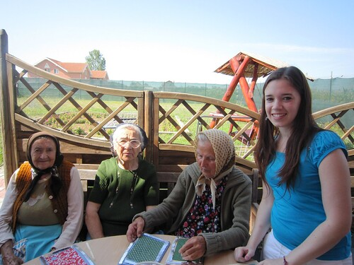
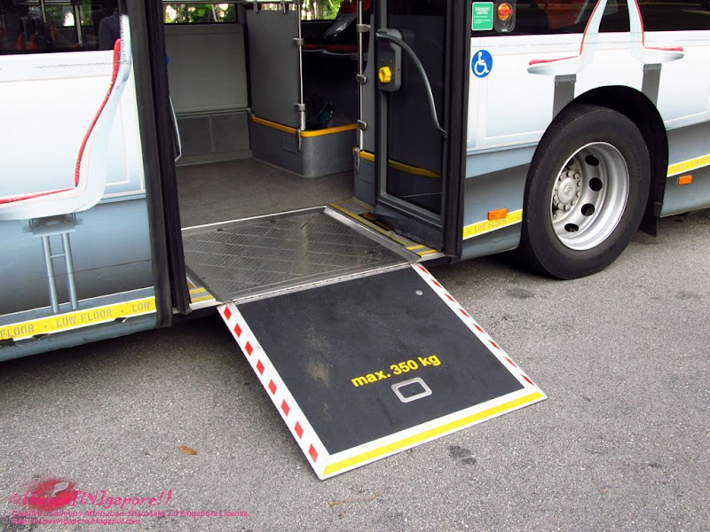

<!--output: html_document: # css: # -->

  

    

       
       

        <h5 class="card-title" style="color: white">Centre de zi</h5>
        
Activitati, evenimente, incluziune sociala
 
       

    

  

  

    

       
       

        <h5 class="card-title" style="color: white">Transport</h5>
        
Persoane varstnice sau cu handicap
 
       

    

  

  

    

       
       

        <h5 class="card-title" style="color: white">Ajutor financiar</h5>
        
Beneficii sociale, ajutor pentru angajare
 
       

    

  

  

    

       <a href="#">
        

        <h5 class="card-title">Ingrijire la domiciliu</h5>
        
Echipamente ortopedice si medicale
 
        

       </a>  
    

  

  

    

       <a href="#">
        

        <h5 class="card-title">Ingrijire in centre specializate</h5>
        
Solutii de lunga durata
 
        

       </a>  
    

  

  

    

       <a href="#">
        

        <h5 class="card-title">Cere ajutor social</h5>
        
Anchete sociale
 
        

       </a>  
    

  

  

  

    

       <a href="#">
        

        <h5 class="card-title">Raporteaza o problema</h5>
        
Abuz, neglijenta...
 
        

       </a>  
    

  

  

    

       <a href="#">
        

        <h5 class="card-title">Persoane cu handicap</h5>
        
Anchete sociale, recuperare
 
        

       </a>  
    

  

  

    

       <a href="#">
        

        <h5 class="card-title" >Sanatate psihica </h5>
        
Dementa, depresie, anxietate...
 
        

       </a>  
    

  

  

